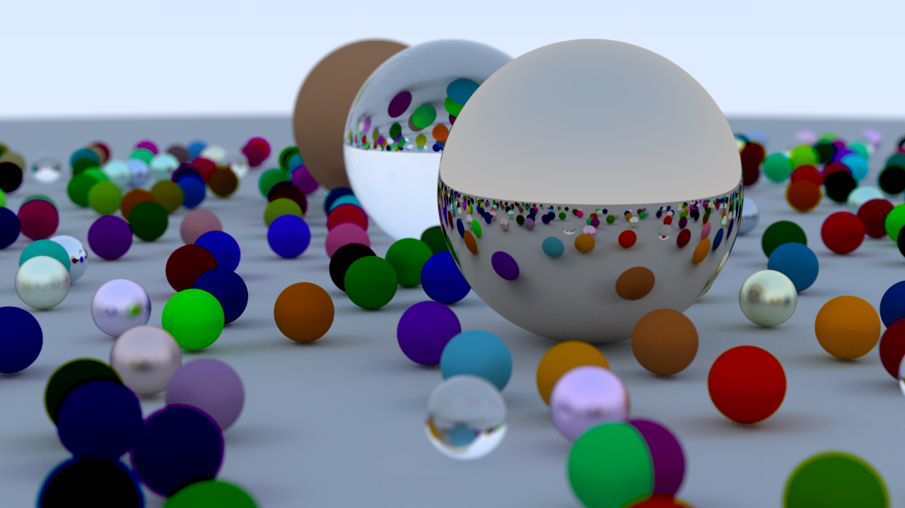

Celerity 
====
[](https://opensource.org/licenses/MIT) [](https://tokei.rs/b1/github/wermos/Celerity) [](https://github.com/wermos/Celerity/actions/workflows/windows.yml) [](https://github.com/wermos/Celerity/actions/workflows/linux.yml)

A multi-threaded ray-tracing engine in C++20, written using [this book](https://raytracing.github.io/books/RayTracingInOneWeekend.html) for inspiration and the theory behind the ideas.

<figure>
  
  <figcaption>A 1920×1080p scene with 487 spheres, and 500 samples per pixel.</figcaption>
</figure>

# Building the Project

## Pre-Requisites

1. A C++20 compliant compiler
    * GCC >= 11 or MSVC >= 19.30 should do.
2. CMake

## Instructions
1. Clone the repository.
    * You can clone the repo by running `git clone https://github.com/wermos/Celerity.git`.
2. Run CMake on the repository.
    * Run `cmake -S. -Bbuild -G[generator]`.
        - If you are on Linux, then you can ignore the `-G` flag (as in, not use it at all) or just use `-G"Unix Makefiles"`. (Since this is the default, both variants have the same behavior.)
		- If you are on Windows (with Visual Studio, presumably), you can use `"Ninja"` or `"Visual Studio 16 2019"` in place of `[generator]`. 
		- If you pass in nothing, then CMake tries to use NMake as the generator.
		- For more help, you can visit the [CMake docs](https://cmake.org/cmake/help/latest/manual/cmake-generators.7.html).
	* To pass in a specific build type, you can append `-DCMAKE_BUILD_TYPE=[type]` to the above command. The choices for `[type]` are the default ones available for any CMake project: `Debug`, `Release`, `RelWithDebInfo`, and `MinSizeRel`.
    * Run `cmake --build build`.
        - On Linux, you can also append `-- -j<num>` to the end of the above command, to run the build on `<num>` cores. For example, 
	    ```bash
	    cmake --build build -- -j4	# for 4 cores
	    ```
3. Run the executable.
    * The executable will be in `build/Celerity/`. The name of the executable `RayTracer` (Linux) or `RayTracer.exe` (Windows).
4. After running, the program saves two images called `pic.jpg` and `pic.png` to the current working directory.
